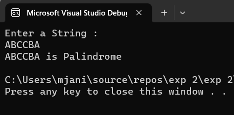
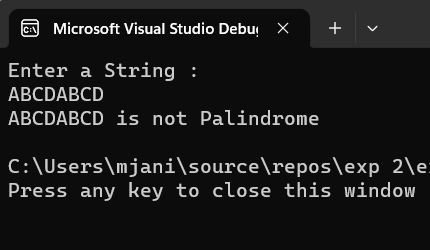

# Palindrome

## Aim:
To write a C# program to find whether the given string is a Palindrome or not.
## Algorithm:

Step1: Start the Program.

Step2: Create a class and declare two variable with string datatype

Step3: Loop over the entire string and reverse it

Step4:
Use if condition to check whether the string and the reversed string is equal or not.

Step5: Print palindrome if it's equal else print not a palindrome.

Step6: Stop the Program.

## Program:

~~~
DEVELOPED BY : ANISH MJ
REGISTER NO : 212221230005
~~~
~~~
using System;
namespace palindrome
{
    class stringl
    {
        public static void Main(string[] args)
        {
            string str,rev="";
            int n;
            Console.WriteLine("Enter a String :");
            str = Console.ReadLine();
            n = str.Length - 1;
            for(int i =n; i >=0; i--)
            {
                rev = rev + str[i];
            }
            if(rev==str)
            
                Console.WriteLine("{0} is Palindrome", str);
            else
                    Console.WriteLine("{0} is not Palindrome", str);
            
        }
    }
}
~~~

## Output:

## Result:
Thus the C# program to display whether the given string is Palindrome or not is executed successfully.
